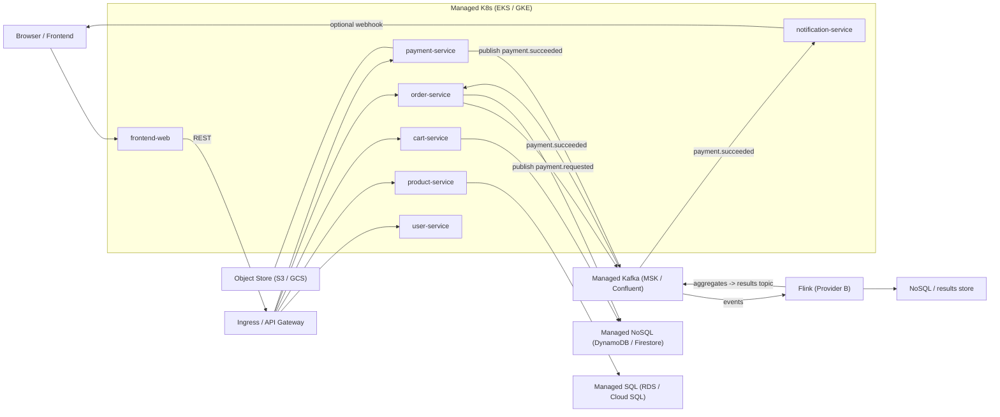
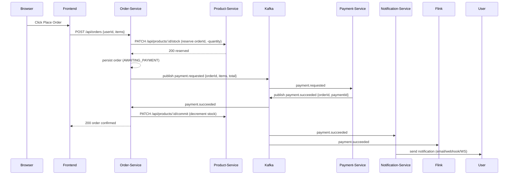
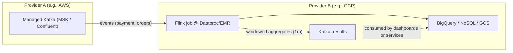
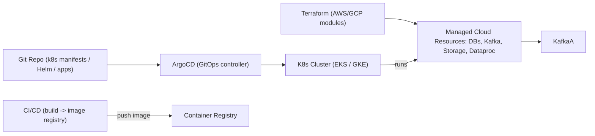
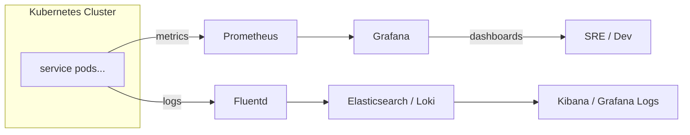

# E-commerce Cloud Architecture Overview

...existing code...

This repository contains a sample microservices-based e-commerce platform designed for multi-cloud deployment. The architecture uses event-driven patterns, managed Kubernetes, and cloud-native data stores.

Key components:

- Microservices: `product-service`, `cart-service`, `order-service`, `payment-service`, `user-service`, `notification-service`.
- Messaging: Apache Kafka for event-driven communication (topics include `payment.requested`, `payment.succeeded`, `payment.failed`, `product.deleted`, and analytics topics).
- Persistence: PostgreSQL for product catalog, DynamoDB for cart and order storage (LocalStack for local emulation).
- Observability: Prometheus + Grafana for metrics, EFK/Loki for logs.
- IaC: Terraform for provisioning cloud infrastructure (AWS/GCP scaffolds included). EKS (AWS) or GKE (GCP) for Kubernetes.

Deployment Strategy:

- Development: Docker Compose with LocalStack and local Kafka broker for end-to-end testing.
- Production: Managed Kubernetes (EKS/GKE) with external Kafka (MSK or managed offering), cloud databases (RDS/Cloud SQL), and S3-compatible storage.

Event Flows:

- Order Flow: `order-service` publishes `payment.requested` after reserving inventory and persisting an `AWAITING_PAYMENT` order. `payment-service` consumes the request, attempts payment, and publishes `payment.succeeded` or `payment.failed`. `order-service` consumes results and updates order status and cart.
- Product Deletion: `product-service` emits `product.deleted` on soft-delete. `cart-service` consumes and removes the product from all carts.
- Analytics: Kafka topics stream to an analytics cluster (e.g., Flink on Dataproc/GKE) for aggregation.

Notes and Next Steps:

- Terraform scaffolds for AWS and GCP are included but not fully provisioned. Fill variables and complete modules (RDS, MSK, IAM) before apply.
- Add GitOps manifests for ArgoCD/Flux and Helm charts for monitoring/logging stacks.
- Implement a Flink job on GCP Dataproc to consume analytics topics and publish aggregates to BigQuery or S3.

High-level architecture
----------------------

This repository contains a multi-cloud, microservices reference implementation scaffold satisfying the assignment requirements:

- Provider A: AWS — Primary services (EKS, RDS/Postgres, S3, Lambda, DynamoDB)
- Provider B: GCP — Analytics/stream processing (Dataproc/Flink)
- Managed Kafka: Confluent Cloud (or AWS MSK / Aiven) — used as the cross-cloud event bus

Microservices (example domain: e-commerce)
- api-gateway (ingress controller / routing)
- user-service (Postgres on RDS)
- product-service (Postgres on RDS)
- cart-service (DynamoDB)
- order-service (EKS-hosted, publishes payment.requested)
- payment-service (EKS-hosted or separate; consumes payment.requested and publishes result)
- notification-service (consumes payment.succeeded, sends notifications)

Analytics service
- Flink job running on GCP Dataproc consuming from Kafka topic `events` and publishing aggregated results to `results` topic.

Serverless
- AWS Lambda function triggered by S3 object creation for async processing (e.g., image resizing, sending events to Kafka).

Deployment & GitOps
- Kubernetes manifests stored under `/k8s/` and managed via ArgoCD applications under `/gitops/argocd/`.

Observability
- Prometheus + Grafana deployed on the cluster via Helm/ArgoCD.
- Centralized logs via EFK or Loki (helm charts referenced).

This repository provides scaffolding: Terraform skeletons, K8s manifests, microservice templates, and run instructions.

Diagrams
--------

> Render these Mermaid diagrams in a Markdown viewer that supports Mermaid (VS Code preview with Mermaid extension or https://mermaid.live).

### High-level architecture

### Order / payment sequence

### Analytics pipeline (Provider A ↔ Provider B)

### Deployment / GitOps / IaC flow

### Observability & Logging

